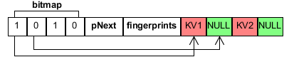

## <center>《FPTreeDB键值存储系统》</center>
# 一. 系统介绍  
FPTreeDB是一个简单的键值存储引擎，我们通过将其包装成一个调用库，供用户程序使用并管理其数据存储，实现相关操作，与LevelDB的使用方式类似   
## 1.1 项目完成成员
李秀祥，蒋能，连泽帆，苏禹行
## 1.2 数据基本操作
1. Insert增
2. Remove删
3. Update改
4. Find查

## 1.3系统恢复方式：
BulkLoading方式  


## 1.4 系统架构：  


## 1.5 项目目录说明：  
```
|__gtest: 为Google Test项目目录，不用管  
|__include: 里包含所有用到的头文件  
   |__fptree: fptree的头文件所在文件夹  
      |__fptree.h: fptree地头文件  
   |__utility: fptree所用工具的头文件所在文件夹  
      |__utility.h: 指纹计算等工具函数所在头文件  
      |__clhash.h: 指纹计算所用哈希函数头文件  
      |__p_allocator.h: NVM内存分配器头文件  
|__src: 为项目源码所在地，完成里面所有的实现  
   |__bin: 可执行文件所在文件夹
      |__main: main.cpp的可执行文件
      |__lycsb: lycsb.cpp的可执行文件
      |__ycsb: ycsb.cpp的可执行文件
   |__fptree.cpp: fptree的源文件，项目核心文件(TODO)  
   |__clhash.c: 指纹计算的哈希函数源文件  
   |__p_allocator.cpp: NVM内存分配器源文件(TODO)  
   |__lycsb.cpp: LevelDB的YCSB测试代码(TODO)  
   |__ycsb.cpp: FPTreeDB和LevelDB的YCSB对比测试代码(TODO)  
   |__makefile: src下项目的编译文件  
|__workloads: 为YCSB测试负载文件，用于YCSB Benchmark测试  
   |__数据量-rw-读比例-写比例-load.txt: YCSB测试数据库装载文件  
   |__数据量-rw-读比例-写比例-run.txt: YCSB测试运行文件  
|__test: 为Google Test用户测试代码所在，请完成编译并通过所有测试  
   |__bin: 单元测试可执行文件所在文件夹
      |__fptree_test: fptree_test.cpp的可执行文件
      |__utility_test: utility_test.cpp的可执行文件
   |__fptree_test.cpp: fptree相关测试  
   |__utility_test.cpp: PAllocator等相关测试  
   |__makefile: gtest单元测试的编译文件   
```

对于FPTree实现，总体理解其实很简单，可以如下理解：
1. 对于FPTree的中间节点实现，同B+tree相关实现
2. 对于FPTree的叶子节点，要用PMDK与NVM进行数据交互
3. 对于PAllocator，就是一个叶子的持久化指针和文件空间分配器，承担叶子文件的映射打开工作
## 1.6 使用工具
VSCODE
## 1.7 项目测试
YCSB测试和 Google Test 测试
# 二.实现步骤

1. 自行编译安装[LevelDB](https://github.com/google/leveldb)，编写利用ycsb测试代码，测试levelDB性能
2. 根据说明和注释完成cpp源文件和编译命令(**使用c++11标准编译**)
3. 编译main和所有的测试代码，通过所有单元测试
4. 利用ycsb测试代码，读取workload的操作，对FPTree进行性能测试，与LevelDB对比


## 2.1实现系统的时间计划：
### 第一阶段：4月25日-5月4日
4.25-4.27：组内成员全部安装好pmdk和LevelDB库并检测效果  
4.28-5.1：分工实现lyscb.cpp，p_allocator和系统说明书  
5.2-5.3：组内交流并修改工作成果，结合LevelDB的使用，分别测试lyscb.cpp，p_allocator.cpp和utility_test.cpp，根据测试结果进一步完善代码  
5.4：整合第一阶段工作成果，提交v1版本branch  
 
### 第二阶段：5月5日-5月11日
5.5-5.7：组内成员合作实现FPTreeDB的插入和重载操作，并通过FPTreeDB的插入和重载测试  
5.8-5.9：合作实现对应的fptree.cpp，完成对应fptree_test.cpp部分的运行  
5.10：组内交流并修改工作成果，测试对应的fptree.cpp，根据测试结果进一步完善代码  
5.11：整合第二阶段工作成果，提交v2版本branch  
 
### 第三阶段：5月12日-5月18日
5.12-5.14：组内成员合作实现FPTreeDB的查询和更新操作，并通过FPTreeDB的查询和更新测试  
5.15-5.16：作实现对应的fptree.cpp，完成对应fptree_test.cpp部分的运行  
5.17：组内交流并修改工作成果，测试对应的fptree.cpp，根据测试结果进一步完善代码  
5.18：整合第三阶段工作成果，提交v3版本branch
 
### 第四阶段：5月19日-5月31日

5.19-5.22：分工实现实现FPTreeDB的删除和剩余的其他操作，并通过FPTreeDB相关操作的测试  
5.23：组内交流并分享工作成果，互相学习，进一步完善  
5.24-5.27：分工实现对应的fptree.cpp，完成对应  fptree_test.cpp部分的运行
5.28：组内交流并分享工作成果，互相学习  
5.29-5.30：组内交流并修改工作成果，测试对应的 fptree.cpp，根据测试结果进一步完善代码  
5.31：整合全部的工作成果，提交final版本branch

## 2.2 FPtree

```
FPTree::FPTree(uint64_t t_degree) //构造

FPTree::~FPTree()//析构
```
```
void FPTree::recursiveDelete(Node* n) //删除树
```
```
InnerNode* FPTree::getRoot()//获得根节点
```
```
void FPTree::changeRoot(InnerNode* newRoot) //新根节点
```
```
void FPTree::insert(Key k, Value v)//插入数据
```
```
bool FPTree::remove(Key k)//删除数据
```
```
bool FPTree::update(Key k, Value v) //更新数据
```
```
Value FPTree::find(Key k) //查找数据
```
```
void FPTree::printTree() //打印树
```
```
bool FPTree::bulkLoading() //重建
```


## 2.3KeyNode
由键值，节点的索引组成    
用于插入和分裂操作中  
    


## 2.4 LeafNode
FPtree所有的键值对数据信息存放于叶子节点中，节点的操作对象是内存映射文件数据的虚拟地址，所以要设置好如下图结构的指针  
    
```
//构造，析构
LeafNode::LeafNode(FPTree* t) 
LeafNode::LeafNode(PPointer p, FPTree* t) 
LeafNode::~LeafNode() 
```
```
//插入，分裂,删除，修改，查询操作
KeyNode* LeafNode::insert(const Key& k, const Value& v) 
void LeafNode::insertNonFull(const Key& k, const Value& v) 
KeyNode* LeafNode::split() 
Key LeafNode::findSplitKey() 
bool LeafNode::remove(const Key& k, const int& index, InnerNode* const& parent, bool &ifDelete) 
bool LeafNode::update(const Key& k, const Value& v) 
Value LeafNode::find(const Key& k) 
int LeafNode::findFirstZero() 
```
```
//获得 bit,key,value
 LeafNode::getBit(const int& idx) 
 LeafNode::getKey(const int& idx) 
 LeafNode::getValue(const int& idx) 
```
```
//保存
void LeafNode::persist() 
```
```
//打印节点
void LeafNode::printNode() 
```

## 2.5 InnerNode
FPtree中间节点的索引  
     
  ```
  //构造，析构
InnerNode::InnerNode() 
 
InnerNode::~InnerNode() 
```
```
//查找目标子节点  
int InnerNode::findIndex(const Key& k) 
```
```
//插入操作  
void InnerNode::insertNonFull(const Key& k, Node* const& node)  
KeyNode* InnerNode::insert(const Key& k, const Value& v)  //键值对插入  
KeyNode* InnerNode::insertLeaf(const KeyNode& leaf)  //叶子结点插入  
```
```
//分裂操作  
KeyNode* InnerNode::split()  
```
```
//删除操作  
bool InnerNode::remove(const Key& k, const int& index, InnerNode* const& parent, bool &ifDelete)   
```
```
//获得左右兄弟节点    
void InnerNode::getBrother(const int& index, InnerNode* const& parent, InnerNode* &leftBro, InnerNode* &rightBro)   

//与父节点及左右兄弟合并  
void InnerNode::mergeParentLeft(InnerNode* const& parent, InnerNode* const& leftBro)
void InnerNode::mergeParentRight(InnerNode* const& parent, InnerNode* const& rightBro) 

//与左右兄弟重分布
void InnerNode::redistributeLeft(const int& index, InnerNode* const& leftBro, InnerNode* const& parent) 
void InnerNode::redistributeRight(const int& index, InnerNode* const& rightBro, InnerNode* const& parent)

//与兄弟合并 
void InnerNode::mergeLeft(InnerNode* const& leftBro, const Key& k)   
void InnerNode::mergeRight(InnerNode* const& rightBro, const Key& k) 
```
```
//删除，修改，查询操作
void InnerNode::removeChild(const int& keyIdx, const int& childIdx) 
bool InnerNode::update(const Key& k, const Value& v) 
Value InnerNode::find(const Key& k) 
```
```
//获得child，key
Node* InnerNode::getChild(const int& idx) 
Key InnerNode::getKey(const int& idx) 
```

## PAllocator
这是NVM文件管理的主要对象，其负责分配LeafNode在NVM中的空间，映射数据文件并返回虚拟地址给LeafNode使用。其管理的叶子文件的粒度是一个LeafGroup，一个LeafGroup由多个叶子以及一个数据头组成，数据头由一个8字节的当前LeafGroup使用叶子数和叶子槽的bitmap，bitmap为了简单使用1个byte指明一个槽位。  

## 主要数据文件
1. LeafGroup结构：| usedNum(8 bytes) | bitmap(n bytes) | Leaf1 | ... | leafN |
2. catelog：| maxFileId(8 bytes) | freeNum(8 bytes) | treeStartLeaf(PPointer) |
3. freeList：| (fId, offset)1, ..., (fId)N |

LeafGroup是数据文件，其文件名用整数表示，从1递增分配即可，规定0为非法标号。PAllocator需要记录分配文件的最大标号，即catalog文件的maxFileId。catalog文件中freeNum为当前可用叶子数，treeStartLeaf为第一个叶子的持久化指针，用于重载树时从其开始，通过链表形式重载。freeList文件每个条目为空叶子的持久化指针，用于启动即可知道可用叶子。

```
//构造析构
PAllocator::PAllocator()  
PAllocator::~PAllocator() 
```
```
// 内存将所有叶映射到Pmem地址，存在FileID对应的虚拟地址处
void PAllocator::initFilePmemAddr() 
```
```
//获得叶子节点及其虚拟地址  
char* PAllocator::getLeafPmemAddr(PPointer p)   
bool PAllocator::getLeaf(PPointer &p, char* &pmem_addr)   
```
```
//叶子节点的状态  
bool PAllocator::ifLeafUsed(PPointer p)   
bool PAllocator::ifLeafFree(PPointer p)   
bool PAllocator::ifLeafExist(PPointer p) 
```
```
//释放叶节点
bool PAllocator::freeLeaf(PPointer p) 
```
```
//写入Catalog进入文件
bool PAllocator::persistCatalog() 
```
```
//创建新的LeafGroup
bool PAllocator::newLeafGroup() 
```


## PMDK
课程设计使用的是PMDK的libpmem库，这是其最基本的一个库，FPTree中所有涉及NVM的操作利用其进行。编程要用到的函数如下：
1. pmem_map_file：打开并映射文件
2. pmem_persist：持久化对NVM内容的修改

## YCSB测试
这是一个键值数据库性能测试的benchmark，细节请看其[github仓库](https://github.com/brianfrankcooper/YCSB)。  
YCSB大体上分两个步：  
第一步是读取load文件，插入一定量的数据对数据库进行初始化。  
第二步是读取run文件，进行数据库相关操作。load和run文件的一条操作语句如下:
```
INSERT 6284781860667377211
```
上面INSERT表示插入操作，后面是键值。因为FPTreeDB键值对为8bytes-8bytes，所以**只需取这个值的前8字节即可**。为了简单起见，**键和值取相同即可**。所以请按上述要求和说明实现lycsb和ycsb的运行代码。

## Google Test单元测试
单元测试的源文件在test文件夹下，每个测试的名称对应其要测试的目标函数和功能，上面介绍的硬性要求的每个阶段需要通过的测试可以通过测试名得知(别说看不懂测试名)。当测试的目标功能没有完成时会发生段错误，所以测试时把未完成的功能的测试先注释掉再跑测试即可。代码**。


