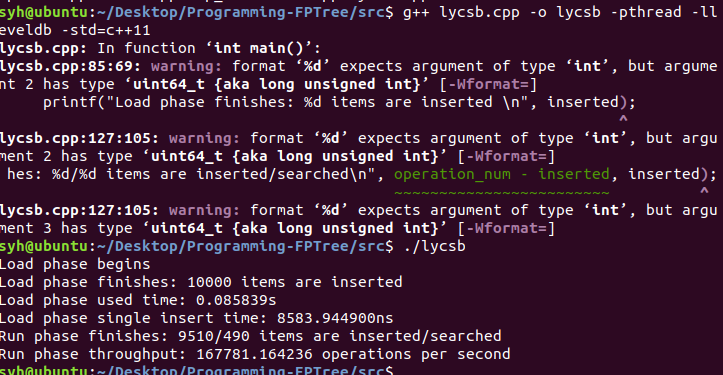

## Level安装  

### 使用以下指令下载leveldb:
```
git clone https://github.com/google/leveldb.git
```
### cmake生成Makefile：
```
cmake CMakelist
make
```
### 编译leveldb并安装:
```
cd leveldb/
mkdir -p build && cd build
cmake -DCMAKE_BUILD_TYPE=Release .. && cmake --build .
```
此时在leveldb/build/目录下生成了一个静态库libleveldb.a  
将静态库复制到<font color=red>/usr/local/lib/</font>  
并把leveldb相关的头文件复制到<font color=red>/usr/local/include/</font>  
```
sudo cp build/libleveldb.a /usr/local/lib/
sudo cp -r include/leveldb/ /usr/local/include/
```
### 安装成功

## 测试运行lycsb.cpp,结果如下:
1w-rw-50-50-load.txt&1w-rw-50-50-run.txt进行性能测试



## 测试成功
